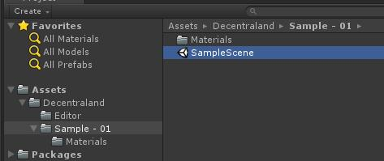
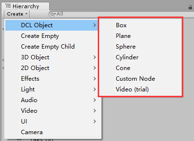

# Quick Guide

Follow these steps to know how this tool works:

1. Install Unity

1. Create an empty Unity project

1. Install the Exporter

1. Open Sample Scene

1. Type in export path

1. Export

1. Preview & Publish

## 1. Install Unity

[Unity 5.x\2017\2018 or higher](https://store.unity.com/download)

## 2. Create an Empty Unity project

Run Unity and click 'New'.


## 3. Install the Exporter

[Download the exporter here](https://github.com/fairwood/DecentralandUnityPlugin/blob/master/downloads/DecentralandUnityExporter.unitypackage)

Drag it into Unity and open the exporter window.


## 4. Open Sample Scene


## 2 Workflows to Choose

### 1. To Now.sh

**Easy to start. Less softwares to install. Can share to others. Recommended for the non-professional.**

Need to install:

- Unity

- DCL Unity Exporter Plugin

- Now.sh

Follow [Export to Now.sh](./docs/ExportToNow.md) to get started.********

### 2. As A Complete DCL Project

**Recommended for professional developers.**

If you are going to preview the scene on your computer, or deploy the scene to IPFS, you should go this way, follow this article*******.


## Introduction: What can you do

### 1. Export these elements

* Box

* Sphere (UV is not correct yet)

* Plane

* Cylinder

* Cone (UV is not correct yet)

* TextMesh (custom font is not supported)

* Standard Materials

* Other models will be exported as glTF models (animations are not supported)

* Lights are not supported

**Note**: Sphere, Cylinder and Cone have a lot of triangles that might exceed dcl limit, so use them carefully.

**Note**: Non-scene assets (e.g. models, materials, textures) should not have same names though duplicated names are available in different folders.

### 2. Help you check whether you obey the scene limitation


All potential errors will be warned right in Unity.

### 3. Create & preview a local scene

If you don't want to use command line tools.


### 4. Edit the land info

e.g. Parcel coordinates, ETH address, Owner's name & email


## Installation Guide

You should prepare these tools on your own:

1. [dcl SDK](https://docs.decentraland.org/documentation/installation-guide/)

1. [Unity 5.x\2017\2018 or higher](https://store.unity.com/download)

Then, download the Exporter which is inside a Unity Package. [Download the Exporter](https://github.com/fairwood/DecentralandUnityPlugin/blob/master/downloads/DecentralandUnityExporter.unitypackage)


## Exporter Guide

### Open the exporter and create a Unity scene

First, create a Unity project, better empty.

Then drag the .unitypackage file into Unity or use "Import Assets.." in Unity. That will extract all assets into your Unity project.

After a while, you should see a new tab in the menu bar like below.


Click the "Scene Exporter" will open the exporter.

**Note:** an auto-generated GameObject called ".dcl" will be created in the hierarchy. Don't edit it.

You can create a new scene or open the sample scene:



The exporter looks like this:


### Setup node.js environment for Unity (Mac Only)

On Mac, you need to run a script to let the ```Init Project``` and ```Start Project``` functions work. Just double-click the ```set_path.command``` file either in Unity or in Finder.


A terminal window will open saying the process is completed. Close it.

### Input land infomation

Edit your parcels' coordinates in this format:
```
12,-21
12,-22
13,-21
13,-22
...
```

**The first line will be the "base" parcel and set as the center in your scene.**

You can also fill up the Owner Info part if you want to publish the scene.

### Create shapes

You must use the specific GameObjects to refer to the DCL primitives. To create a DCL primitive, you need to go to the following menu.



If you want to convert a lot of Unity primitives into DCL primitives, there is a 'Convert' function in Decentraland tab in the menubar.

*Why don't we use Unity primitves? Because the primitives between Unity and DCL have a little difference. For example, the Unity Cube and the DCL Box have different UV map, that will make your scene look different in two platforms.*

Then, build your world as you like.

You can use models from outer model files (Unity does not support importing glTF, but we can export things as glTF). However, only the Unity Standard Shader is supported to export. That is enough to make a nice scene.

Most properties of the Standard Material can be well exported, but things might still look a bit different in DCL. We will improve the consistency all the time.

### Important notice about non-primitives

The exporter traverses the whole scene. When it finds a non-primitive model, it will pack the model all the model's children and export one gltf file. That means, GameObjects under a non-primitive model will not generate their own node, even if they are primitives themselves. Instead, their data will be contained in the parent's gltf file.

### Before export

Before export, you should check the statistics part. That shows some important indexes with their limitations. If something is wrong, you will see bright yellow warnings.


Then, you can also go through the hierarchy view where will tell you what type of node will be generated from each GameObject.


**Input or select the path of the folder to export files.**


**If you have not initialized a DCL project in the selected folder, you might want to create one. Just click the ```Init Project``` button.** This has the same effect as executing 'dcl init' in command line tool.

(If you are on Mac and the button does not work, go check [Setup node.js environment for Unity](https://github.com/fairwood/DecentralandUnityPlugin#setup-nodejs-environment-for-unity-mac-only))

### Export

2 files and 1 folder will be exported and all old files will be overridden:

* scene.tsx

* scene.json

* unity_assets/(.gltf and textures)

Click "Export" button to export. If success, a log will be shown in Unity console.

Finally, you can click 'Run Project' to see it in the browser (need to wait some seconds).

*If you want to publish the scene to IPFS, you should do it in the command line.*

## More Tools to Learn

### [ProBuilder](https://assetstore.unity.com/packages/tools/modeling/probuilder-111418)

**ProBuilder** is a very famous 3D building tool in Unity Asset Store. It is very convenient for level design or prototyping and can be a substitution to 3D modeling software like 3DS MAX. And, it is free now!

## Special Thanks to

### Support from Decentraland Team

Ari Meilich

[Esteban Ordano](https://github.com/eordano)

Matias Bargas

Chris Chapman

Jayson Hu

Diff

### Test Users

时光倒流

不异

### Unity-glTF Tools

[@neil3d/Unity-glTF-Exporter](https://github.com/neil3d/Unity-glTF-Exporter)


# Donations

#### ETH/MANA/LAND/ERC20...

 0x1a38ac06099D648Bb14418D61956133a3d0E1f1C

#### BTC

1JEFCP4hqa3Gd7aQ5unWoLP6S6mD17K9HQ


### [Mac set up tutorial](./docs/mac_setup_tutorial.md)
In this tutorial,you can learn how to set PATH and do interaction with Terminal Application.