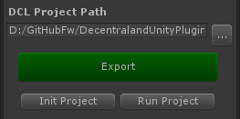

# Quick Guide


Follow these steps to know how this tool works:

1. Install Unity

1. Create an empty Unity project

1. Install the Exporter

1. Open Sample Scene

1. Type in export path

1. Export

1. Preview & Publish

## 1. Install Unity

[Unity 5.x\2017\2018 or higher](https://store.unity.com/download)

## 2. Create an empty Unity project

Run Unity and click 'New'.


## 3. Install the Exporter

[Download the exporter here](https://github.com/fairwood/DecentralandUnityPlugin/blob/master/downloads/DecentralandUnityExporter.unitypackage)

Drag it into Unity and open the exporter window.


## 4. Open the sample scene


## 5. Select an folder to export


## 6. Export

Click ```Export``` button.


It is done when you see "Export Complete" in the console.


Go to the target folder, you will find your DCL project.

## 7. Preview & Publish

You have 2 ways to preview and publish.

### 1. To Now.sh

**Easy to start. Less softwares to install. Can share to others. Recommended for the non-professional.**

Need to install:

- Now.sh

Follow [Export to Now.sh](./docs/ExportToNow.md).

### 2. As A Complete DCL Project

**Recommended for professional developers.**

If you are going to preview the scene on your computer, or deploy the scene to IPFS, you should go this way.

Need to install:

- Node.js

- Decentraland SDK

You can follow the [DCL official document](https://docs.decentraland.org/getting-started/installation-guide/) to setup the Decentraland SDK.


# More about Decentraland Unity Plugin

## Introduction: What can you do

### 1. Export these elements

* Box

* Sphere

* Plane

* Cylinder

* Cone

* TextMesh (custom font is not supported)

* Standard Materials

* Other models will be exported as glTF models (animations are not supported)

* Lights are not supported

**Note**: Sphere, Cylinder and Cone have a lot of triangles that might exceed dcl limit, so use them carefully.

**Note**: Non-scene assets (e.g. models, materials, textures) should not have same names though duplicated names are available in different folders.

### 2. Check whether you obey the scene limitation


All potential errors will be warned right in Unity.

### 3. Create & preview a local scene

You can initialize an new dcl project and run a project right in Unity, if you have setup DCL SDK.



**On Mac**, however, you need to run a script to let the ```Init Project``` and ```Start Project``` functions work. Just double-click the ```set_path.command``` file either in Unity or in Finder.


A terminal window will open saying the process is completed. Close it.

### 4. Edit land info

e.g. Parcel coordinates, ETH address, Owner's name & email

Edit your parcels' coordinates in this format:
```
12,-21
12,-22
13,-21
13,-22
```

**The first line will be the "base" parcel and set as the center in your scene.**

You can also fill up the Owner Info part if you want to publish the scene.

### Create Decentraland shapes and nodes

You must use the specific GameObjects to refer to the DCL primitives. To create a DCL primitive, you need to go to the following menu.


*Why don't we use Unity primitves? Because the primitives between Unity and DCL are different. For example, the Unity Cube and the DCL Box have different UV map, that will make your scene look different in two platforms.*

### Important notice about non-primitives

The exporter traverses the whole scene. When it finds a non-primitive model, it will pack the model all the model's children and export one gltf file. That means, GameObjects under a non-primitive model will not generate their own node, even if they are primitives themselves. Instead, their data will be contained in the parent's gltf file.

### Check what kinds of nodes will be exported

 you can also go through the hierarchy view where will tell you what type of node will be generated from each GameObject.


### What are exported

2 files and 1 folder will be exported and all old files will be overridden:

* scene.tsx

* scene.json

* unity_assets/(.gltf and textures)

*If you want to publish the scene to IPFS, you should do it in the command line.*

## More Tools to Learn

### [ProBuilder](https://assetstore.unity.com/packages/tools/modeling/probuilder-111418)

**ProBuilder** is a very famous 3D building tool in Unity Asset Store. It is very convenient for level design or prototyping and can be a substitution to 3D modeling software like 3DS MAX. And, it is free now!

## Special Thanks to

### Support from Decentraland Team

Ari Meilich

[Esteban Ordano](https://github.com/eordano)

Matias Bargas

Jayson Hu

Diff

### Test Users

时光倒流

不异

### Unity-glTF Tools

[@neil3d/Unity-glTF-Exporter](https://github.com/neil3d/Unity-glTF-Exporter)

# Donations

#### ETH/MANA/LAND/ERC20...

 0x1a38ac06099D648Bb14418D61956133a3d0E1f1C

#### BTC

1JEFCP4hqa3Gd7aQ5unWoLP6S6mD17K9HQ

### [Mac set up tutorial](./docs/mac_setup_tutorial.md)
In this tutorial,you can learn how to set PATH and do interaction with Terminal Application.